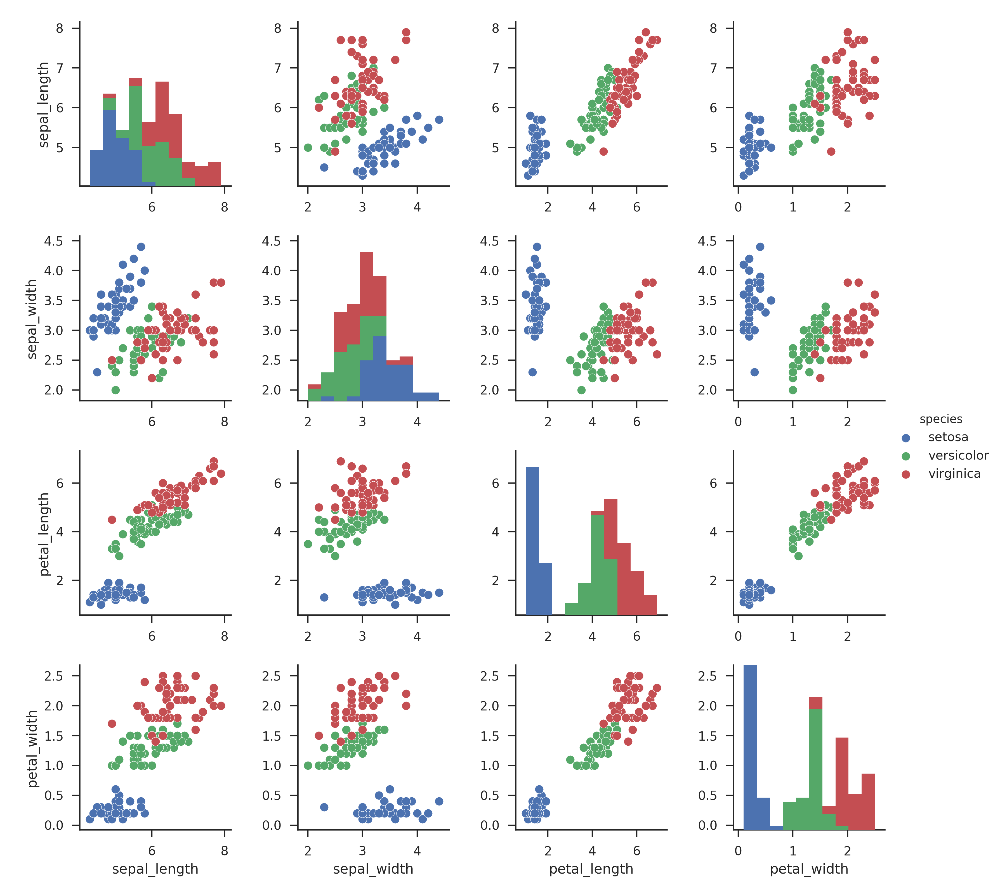
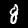
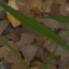

# Training Tutorial

This section walks through one of the most common deep learning tasks - training a Neural Network.

## Tabular Data - The Iris Dataset

A very common dataset to test algorithms with is the _Iris Dataset_, a simple 4-attribute classification dataset. The following explains how to build a neural network in the Weka workbench GUI and from the command line.



### GUI

- Click `Open file...` and open the `iris.arff` dataset.
- Switch to the `Classify` panel and select `functions` > `Dl4jMlpClassifier` as the classifier.
- Click `Start` to begin training. By default the classifier only has one layer (the output layer) but this does have trainable weights so can be fit to the dataset. Note the cross-validated accuracy. 
- Try adding a single dense layer with 32 outputs and see how the accuracy improves. You'll note we've gone from 12 parameters, to 259 after only adding a single layer - neural networks can contain a lot of weights quite quickly as we add more layers.
- Finally add one more layer with 32 outputs again - you should see a minor improvement in accuracy again, but not as much as before.

By default WEKA performs 10-fold cross-validation on your data. This trains 10 different classifiers on subsets of the data, then averages their performance for the final summary result. This is fine for smaller datasets & models but as we continue this tutorial it may take too long to do full 10-fold cross-validation. A faster method is to do a training/test split on the loaded dataset.
- In `Test options`, select `Percentage split` and set the `%` field to `80`. This will train the model on 80% of the data, evaluating it on the remaining 20%.

### Commandline

<!-- TODO -->

<!-- Starting simple, the most straight forward way to create a neural network with this package is by using the commandline. A Single-Layer-Perceptron (the most basic neural network possible) is shown in the following
```bash
$ java weka.Run \
    .Dl4jMlpClassifier \
    -S 1 \
    -layer "weka.dl4j.layers.OutputLayer \
            -activation weka.dl4j.activations.ActivationSoftmax \
            -lossFn weka.dl4j.lossfunctions.LossMCXENT" \
    -config "weka.dl4j.NeuralNetConfiguration \
            -updater weka.dl4j.updater.Adam" \
    -numEpochs 10 \
    -t datasets/nominal/iris.arff \
    -split-percentage 80
``` -->

## Image Data - the MNIST dataset
  





This next section will walkthrough a more common scenario - training a neural network on an image-classification dataset. We will first demonstrate this simply with a cutdown version of the MNIST dataset, which provides images of handwritten digits of 10 classes (0-9). We'll also introduce you to the **WekaDeeplearning4j** Model Zoo.

### GUI

- Back in the `Preprocess` panel, open the `mnist.meta.minimal.arff` dataset.
**Important note:** You'll notice that the format of this dataset is quite different to the previous one. Whereas *Iris* specified all attributes explicitly, this current *MNIST* `.arff` file only specifies the filename and its associated class; this is a much more common use case (especially for image classification) so it's important to understand how to work with this.
- Reset the `Dl4jMlpClassifier` configuration by selecting a different classifier (e.g., `RnnSequenceClassifier`) and then changing back to the `Dl4jMlpClassifier`.

If you click `Start` WEKA will throw an error (`...Dl4jMlpClassifier: Cannot handle string attributes`). This is because we're using a 'meta-style' dataset which only contains filenames. We need to configure the `Dl4jMlpClassifier` further to handle this new type of dataset.
- In the `Dl4jMlpClassifier` settings, change the `instance iterator` from `DefaultInstanceIterator` to `ImageInstanceIterator`.
- In the `ImageInstanceIterator` settings, set the `directory of images` to the `mnist-minimal` folder, and the `size of mini batch` to 64 (you can reduce this if you run into out-of-memory issues). 


- Leave all other settings as default and click `Start` to train your model on MNIST. You should get an accuracy ~71% which isn't great, but OK considering the model is only using the single output layer. Designing neural network architectures is an open research area and far outside the scope of this tutorial, so we won't dive too deep into custom layer setups but instead focus on using predefined architectures from the **WekaDeeplearning4j Model Zoo**.

### Command Line

<!-- TODO -->

## Fine-tuning a model from the Model Zoo.

**WekaDeeplearning4j's** Model Zoo contains a set of predefined state-of-the-art architectures which can be used on your dataset out-of-the-box. In addition, most of them include pre-trained weights which means they can require less training to converge than training a model from scratch (with randomly-initialized weights).

As we're training on the MNIST dataset, it would make sense to use a pretrained model suited for this. The `LeNet` architecture is one of the earliest CNN architectures, and was initially proposed in use with the MNIST dataset. The `Dl4jLeNet` model included in **WekaDeeplearning4j** brings this (relatively) basic CNN architecture which we'll use for this section.

### GUI

- In the `Dl4jMlpClassifier` settings change the `zooModel` from `CustomNet` to `Dl4jLeNet`.
- That's all you need to change! Click `Start` to begin fine-tuning the pretrained `Dl4jLeNet` model.

You should get a marked improvement in accuracy over the previous (default layer-setup) model of ~88%.

### Commandline

<!-- TODO -->

#### Further Experiments
- Try different numbers of epochs (10, 20, 30, 40, 50) in the `Dl4jMlpClassifier` settings.
- Try training the `Dl4jLeNet` model *without* pretrained weights.
    - In the `Dl4jLeNet` settings, change `Pretrained type` from `MNIST` to `None`

## Fine-tuning a model on a Custom Dataset
  



This tutorial will walk through the steps required to finetune a pretrained model on your custom dataset.

The dataset used in this tutorial is from the [Plant Seedlings Classification](https://www.kaggle.com/c/plant-seedlings-classification) competition on Kaggle. Visit the link to download the dataset.

The previous section is a useful walkthrough if you're training a model on a dataset which already has an `.arff` file correctly defined. For most use-cases in the wild, however, this is not the case; a more common case is a 'folder organised' dataset format - images are sorted into subfolders, with the class name being the subfolder name. This format is intuitive and easy to work with but cannot be loaded directly into WEKA without further processing.

### Loading a dataset in without an `.arff` file - Introduction to the **ImageDirectoryLoader**

**WekaDeeplearning4j** comes with the `ImageDirectoryLoader`, a simple tool which creates an `.arff` file from a 'folder organised' dataset.

#### GUI Usage
The `ImageDirectoryLoader` can be invoked by selecting a **folder** instead of a **file** from the
`Open file...` menu.

Click `Open File...` and navigate to the `train/` folder in the Plant Seedlings dataset
you just downloaded.


Click `Ok` and choose the `ImageDirectoryLoader` in the following popup.


There are no settings to change so simply click `OK` to run - you should be taken back to the 
`Preprocess` panel with your instances now loaded.


#### Commandline Usage
The tool can also be run from the command line
```bash
java weka.Run .ImageDirectoryLoader -i <input dataset path> -name <output arff filename>
```
e.g.:
```bash
java weka.Run .ImageDirectoryLoader -i /path/to/plant-seedlings/data/train -name plant-seedlings-train.arff
```

The associated meta `.arff` file has been created at the path specified and can be loaded into WEKA just as any other `.arff` file. As we're simply checking accuracy within WEKA, we won't load in the `test/` data and submit it to Kaggle - that is outside the scope of this tutorial.

**Important note:** This process creates a 'meta' arff which contains two features, the first one being the `filename` and the second one being the `class`. As above, it is necessary to define an `ImageInstanceIterator` (in `Dl4jMlpFilter` or `Dl4jMlpClassifier`) which uses these filenames in the directory given by the option `-imagesLocation`.

### Training - GUI

- If you haven't already, set `Dl4jMlpClassifier` as the `Classifier` and select the `ImageInstanceIterator` as `instance iterator`.
- In the `ImageInstanceIterator` settings, set the `images location` to the `train/` directory in the Plant Seedlings dataset folder.
- As we'll be using a larger model than before, your machine may not be able to handle a `batch size` of `64`. Set it to `8` for now. We'll be using a pretrained model (which has a fixed input size) so the width, height, and number of channels don't need to be set. 


For the sake of this tutorial, we'll use a pretrained Keras ResNet50 model. 
- Select `KerasResNet` from the `zooModel` option.


Note that by default, the layer specification is **not** loaded in the GUI for usability reasons;
loading the layers every time an option is changed can slow down the GUI significantly. If, however, you'd like
to view the layers of the zoo model you've selected, set the `Load layer specification in GUI` flag to true.

A holdout evaluation strategy has to be selected in the `Test options` box via `Percentage split`, 
which can be set to 66% for a 2/3 - 1/3 split. The classifier training is now ready to be started with the `Start` button. 
The resulting classifier evaluation can be examined in the `Classifier output` box. Here, an evaluation summary is shown for the training and testing split. 

The above setup, trained for 20 epochs with a batch size of 16 produces a classification accuracy of 94.51% on the
 test data.

```text

Correctly Classified Instances        1497               94.5076 %
Incorrectly Classified Instances        87                5.4924 %
Kappa statistic                          0.9392
Mean absolute error                      0.01  
Root mean squared error                  0.0894
Relative absolute error                  6.6502 %
Root relative squared error             32.5587 %
Total Number of Instances             1584     

=== Confusion Matrix ===

   a   b   c   d   e   f   g   h   i   j   k   l   <-- classified as
  44   0   0   0   6   0  38   0   0   0   0   0 |   a = Black-grass
   0 128   0   0   0   1   0   0   0   1   0   0 |   b = Charlock
   0   0  92   2   0   0   0   0   0   0   0   2 |   c = Cleavers
   0   1   0 202   0   0   1   0   0   0   0   0 |   d = Common Chickweed
   2   0   0   0  69   0   2   0   0   0   0   1 |   e = Common wheat
   1   0   1   0   1 154   0   0   0   0   0   1 |   f = Fat Hen
  11   0   0   0   0   0 206   0   1   0   0   0 |   g = Loose Silky-bent
   0   0   0   0   0   0   3  71   0   0   0   0 |   h = Maize
   1   0   0   0   0   0   0   0 171   0   0   0 |   i = Scentless Mayweed
   0   0   0   1   0   0   0   0   5  71   0   0 |   j = Shepherds Purse
   0   0   0   0   0   0   1   0   0   0 164   0 |   k = Small-flowered Cranesbill
   0   1   0   2   0   0   0   0   0   0   0 125 |   l = Sugar beet
```


## Training - Commandline
Ensure `weka.jar` is on the classpath. The following run finetunes a pretrained ResNet model for 20 epochs. This shows how to specify a non-default variation from the command line.
```bash
$ java weka.Run \
    .Dl4jMlpClassifier \
    -S 1 \
    -iterator ".ImageInstanceIterator -imagesLocation plant-seedlings/data/train -bs 16" \
    -normalization "Standardize training data" \
    -zooModel ".KerasResNet -variation RESNET152V2" \
    -config "weka.dl4j.NeuralNetConfiguration -updater \"weka.dl4j.updater.Adam -lr 0.1\"" \
    -numEpochs 20 \
    -t plant-seedlings/data/train/plant-seedlings-train.arff \
    -split-percentage 66
```

#### Further Experiments

The default variation is `RESNET50`, so we'll change that to `RESNET152V2`.