# Training Tutorial

<div style="display: flex; justify-content: space-evenly">
    <a href="1-introduction_setup.html">Previous Page</a>
    <a href="/I2K-Tutorial">Home</a>
    <a href="3-feature_extraction.html">Next Page</a>
</div>

This section walks through a common deep learning task - training a Neural Network. **WekaDeeplearning4j** allows you to do this in one of two ways, both of which will be explained in this section:
- Design your own architecture, specifying a custom layer setup
- Use a well-known pre-defined architecture from the **Model Zoo**. Most models from the **Model Zoo** have the added benefit of a pre-trained option, which tends to improve generality and reduce the training required on your end to achieve good performance.

## Starting Simple - The Iris Dataset (Tabular)

A very common dataset to test algorithms with is the _Iris Dataset_, a simple 4-attribute classification dataset. Although this is often used to demonstrate classical ML algorithms (e.g., boosting, decision trees), neural networks can also be applied to this style of dataset.

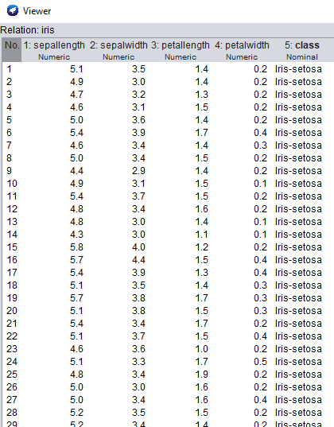


We're going to start with a simple network, progressively adding layers and noting the effect this has on performance & model size.

### GUI

- Click `Open file...` and open the `iris.arff` dataset.
- Switch to the `Classify` panel and select `functions` > `Dl4jMlpClassifier` as the classifier.
- Click `Start` to begin training. You should see the **Progress Manager** show a progress bar indicating the progress and ETA. By default the classifier only has one layer (the output layer) but this does have trainable weights so can be fit to the dataset. Note the cross-validated accuracy. 

We're now going to start adding some layers:

- Click `layer specification` to open the `GenericArrayEditor`. From here we can edit the model's layers. 
- Click `Choose` and select the `DenseLayer`.
- Open the `DenseLayer` settings and set `number of outputs` to `32`.
- Click `OK` to save the configuration and click `Start` again to see how the accuracy improves. 

You'll note we've gone from 12 parameters, to 259 after only adding a single layer - neural networks can balloon in size very quickly as we add more layers!

- Finally add one more `DenseLayer` with `8` outputs.

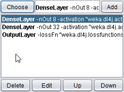

Train the model again and you should see a minor improvement in accuracy again, but not as much as before.

You may notice it training the model many times; by default WEKA performs 10-fold cross-validation on your data. This trains 10 different classifiers on subsets of the data, then averages their performance for the final summary result. This is fine for smaller datasets & models but as we continue this tutorial and train larger models it may take too long. For the sake of this tutorial, a faster method is to do a training/test split on the loaded dataset.

- In `Test options`, select `Percentage split` and set the `%` field to `80`. This will train the model on 80% of the data once, evaluating it on the remaining 20%.

### Command Line

```bash
$ java weka.Run .Dl4jMlpClassifier \
    -layer "weka.dl4j.layers.DenseLayer -nOut 8" \
    -layer "weka.dl4j.layers.DenseLayer -nOut 32 " \
    -layer "weka.dl4j.layers.OutputLayer -nOut" \
    -t $WEKA_HOME/packages/wekaDeeplearning4j/datasets/nominal/iris.arff
    -split-percentage 80
```

## Starting Simple - The MNIST Dataset (Image)
  


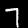


This next section will walkthrough training a neural network on an image-classification dataset, using a cutdown version of the **MNIST** dataset, which provides images of handwritten digits of 10 classes (0-9). We'll also introduce you to the **WekaDeeplearning4j** Model Zoo.

### GUI

- Back in the `Preprocess` panel, open the `mnist.meta.minimal.arff` dataset.

**Important note:** You'll notice that the format of this dataset is quite different to the previous one. Whereas `iris.arff` specified all attributes explicitly, this version of **MNIST** only specifies the filename and its associated class; this is a much more common use case (especially for image classification) so it's important to understand how to work with this in **WekaDeeplearning4j**.

Going to the `Classify` panel, if you click `Start` WEKA will throw an error (`...Dl4jMlpClassifier: Cannot handle string attributes`). This is because we're using a 'meta-style' dataset which only contains filenames. We need to configure the `Dl4jMlpClassifier` further to handle this new type of dataset and tell it what to do with these filenames.
- In the `Dl4jMlpClassifier` settings, change the `instance iterator` from `DefaultInstanceIterator` to `ImageInstanceIterator`.
- In the `ImageInstanceIterator` settings, set the `directory of images` to `mnist-minimal/images/` , and the `size of mini batch` to 64 (you can reduce this if you run into out-of-memory issues). 

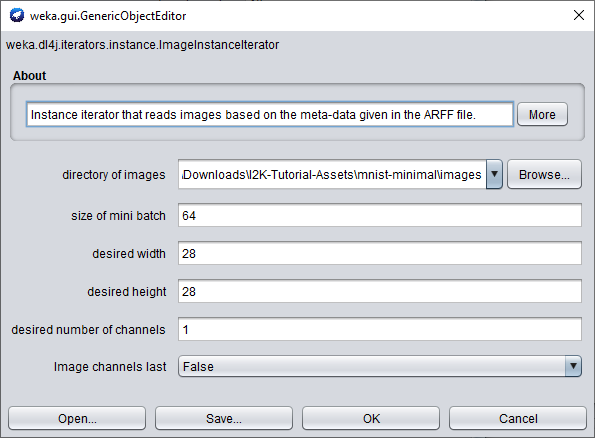

- Delete the 2 layers we previously added (leaving only the `OutputLayer`) and click `Start` to train your model. 

### Command Line

```bash
$ java weka.Run .Dl4jMlpClassifier \
    -iterator ".ImageInstanceIterator \
        -imagesLocation $WEKA_HOME/packages/wekaDeeplearning4j/datasets/nominal/mnist-minimal -bs 64" \
        -t $WEKA_HOME/packages/wekaDeeplearning4j/datasets/nominal/mnist.meta.minimal.arff \
        -split-percentage 80
```

You should get an accuracy ~71% which is OK considering the model is only using the single output layer. We won't go any further into custom architectures at this point but instead look at using a model from the **WekaDeeplearning4j Model Zoo**.

## Fine-tuning a Zoo Model

**WekaDeeplearning4j's** Model Zoo contains a set of predefined state-of-the-art architectures which can be used on your dataset out-of-the-box. In addition, most of them include pre-trained weights so they often require less training to converge than training a model from scratch (with randomly-initialized weights).

As we're training on **MNIST**, it would make sense to use a pretrained model suited for this dataset. The **LeNet** architecture is one of the earliest CNN architectures proposed and was initially done so for use on the **MNIST** dataset. The `Dl4jLeNet` model included in **WekaDeeplearning4j** makes this (relatively) basic CNN architecture available, which we'll use for this section.

Note that the first time this is run the pretrained weights may need to be downloaded in which case actual runtime will be longer. These weights are cached locally so subsequent runs are faster.

### GUI

- In the `Dl4jMlpClassifier` settings change the `zooModel` from `CustomNet` to `Dl4jLeNet`.
- That's all you need to change! Click `Start` to begin fine-tuning the pretrained `Dl4jLeNet` model.

You should get a marked improvement in accuracy over the previous (default layer-setup) model of ~88% with a single click - using pretrained models couldn't get much easier!

### Commandline

```bash
$ java weka.Run .Dl4jMlpClassifier \
    -iterator ".ImageInstanceIterator \
        -imagesLocation $WEKA_HOME/packages/wekaDeeplearning4j/datasets/nominal/mnist-minimal -bs 64" \
        -zooModel ".Dl4jLeNet" \
        -t $WEKA_HOME/packages/wekaDeeplearning4j/datasets/nominal/mnist.meta.minimal.arff \
        -split-percentage 80
```

## Fine-tuning a model on a Custom Dataset

The previous section is a useful walkthrough if you're training a model on a dataset which already has an `.arff` file correctly defined. For most use-cases 'in the wild', however, this is not the case; a more common case for image classification is a 'folder organised' dataset format - images are sorted into subfolders, with the class name being the subfolder name. This format is intuitive and easy to work with but cannot be loaded directly into WEKA without a few extra steps.

The dataset used in this tutorial is from the [Plant Seedlings Classification](https://www.kaggle.com/c/plant-seedlings-classification) competition on Kaggle, which is supplied in the tutorial asset folder.

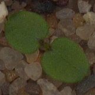


### Loading a dataset in without an `.arff` file - Introduction to the **ImageDirectoryLoader**

**WekaDeeplearning4j** comes with the `ImageDirectoryLoader`, a simple tool which creates an `.arff` file from a 'folder organised' dataset.

#### GUI Usage
The `ImageDirectoryLoader` can be invoked by selecting a *folder* instead of a *file* from the `Open file...` menu, from the **Preprocess** panel.

- Click `Open File...` and navigate to the `train/` folder in the Plant Seedlings dataset.

    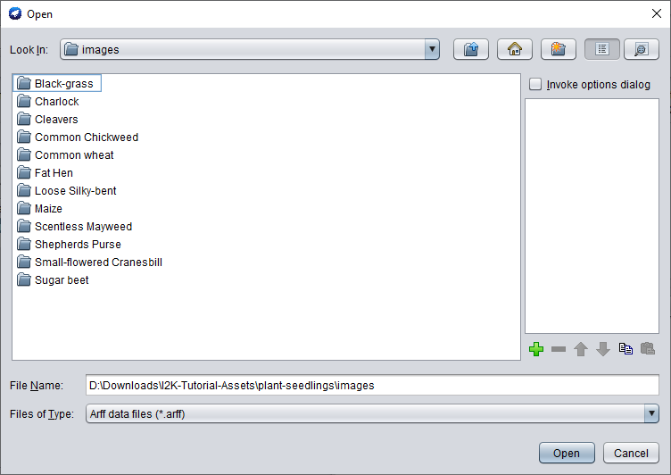

- Click `Ok` and choose the `ImageDirectoryLoader` in the following popup.

    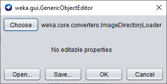

- There are no settings to change so simply click `OK` to run - you should be taken back to the `Preprocess` panel with your instances now loaded.

    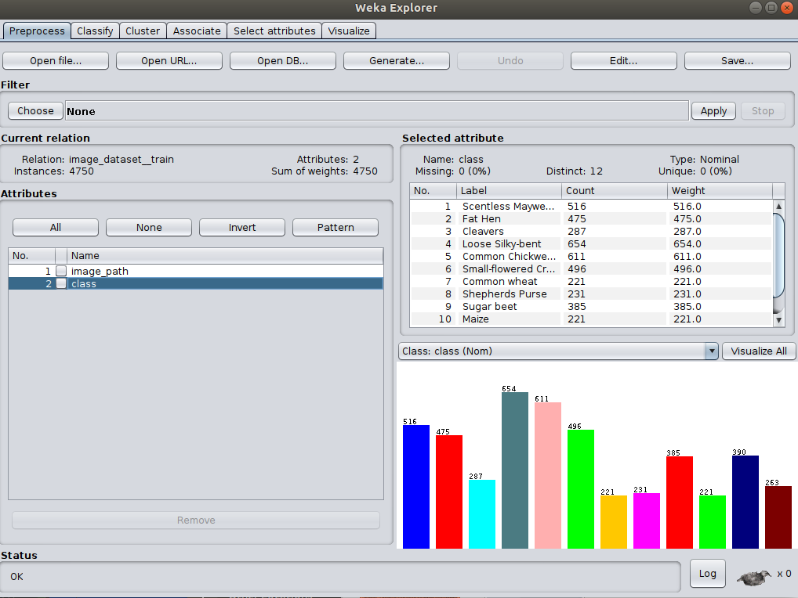

The **ImageDirectoryLoader** loads the dataset into the 'meta' format similar to the MNIST dataset we used above.

#### Commandline Usage
The tool can also be run from the command line
```bash
java weka.Run .ImageDirectoryLoader -i <input dataset path> -name <output arff filename>
```
e.g.:
```bash
java weka.Run .ImageDirectoryLoader -i /path/to/plant-seedlings/data/train -name plant-seedlings-train.arff
```

The associated meta `.arff` file has been created at the path specified and can be loaded into WEKA just as any other `.arff` file. 

As we're simply checking accuracy within WEKA, we won't load in the `test/` data and submit it to Kaggle - that is outside the scope of this tutorial.

### Training - GUI

Now that we've loaded our custom dataset, we can get back to setting up our model.

- If you haven't already, set `Dl4jMlpClassifier` as the `Classifier` and select the `ImageInstanceIterator` as `instance iterator`.
- In the `ImageInstanceIterator` settings, set the `images location` to the `images/` directory in the `plant-seedlings` dataset folder.
- As we'll be using a larger model than before, your machine may not be able to handle a `batch size` of `64`. Set it to `8` for now. We'll be using a pretrained model (which has a fixed input size) so the width, height, and number of channels don't need to be set. 

    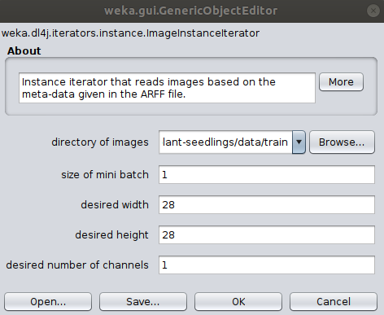


For the sake of this example, we'll use the tried-and-tested **ResNet** architecture.
<!-- For the sake of this example, we'll use the newly-announced **EfficientNet** architecture, which out-performed previous SOTA classification models at a range of model sizes ([blog post](https://ai.googleblog.com/2019/05/efficientnet-improving-accuracy-and.html)):  -->

- Select `KerasResNet` from the `zooModel` option.

    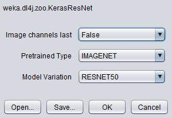

Note that by default, the layer specification is **not** loaded in the GUI for usability reasons;
loading the layers every time an option is changed can slow down the GUI significantly. If, however, you'd like
to view the layers of the zoo model you've selected, set the `Load layer specification in GUI` flag to true.

#### Rapid Prototyping

One difficulty with rapid prototyping in ML is that large datasets & models can increase your iteration time, slowing down development. Following are some useful techniques to avoid this:

**Dataset Resampling**

Using the `Resample` filter, we can randomly take out instances from our dataset while roughly preserving the class balance (how many images are in each category). 

- In the `Preprocess` panel, select the `Resample` filter:

    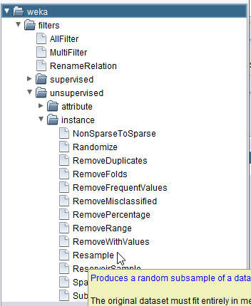

- Set the `sampleSizePercent` to a value < `100`:

    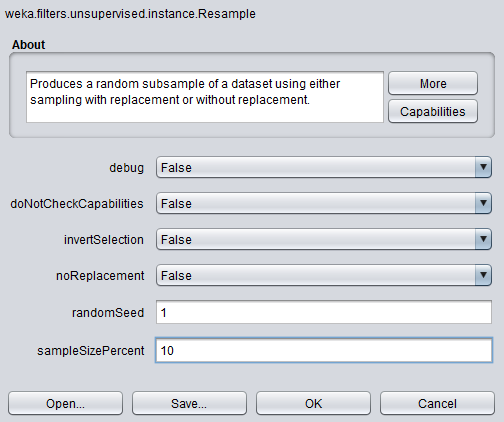

- Click `Apply` to resample the dataset down to your specified size.

**Reduce Training Epochs**

As we're getting to modern CNN architectures, their size becomes large and training takes a long time. We can reduce the training time during experimentation, and then easily scale it back up once we've decided on the configuration.

- In the `Dl4jMlpClassifier` settings, change `number of epochs` to `1`

We're now ready for a short training run.

- Keeping the same `80%` split, click `Start`

### Training - Commandline

```bash
$ java weka.Run \
    .Dl4jMlpClassifier \
    -S 1 \
    -iterator ".ImageInstanceIterator -imagesLocation plant-seedlings/data/train -bs 8" \
    -zooModel ".KerasResNet" \
    -numEpochs 1 \
    -t plant-seedlings/data/train/plant-seedlings-train.arff \
    -split-percentage 80
```

## Further Experiments

We've introduced a few new features already, so now is the time to do some exploration of your own. Below are some suggestions for things to try out - try improve the accuracy over what we achieved with defaults.

- **Custom Dataset** - if you've got your own dataset, try loading that into WEKA for your exploration. If not, feel free to use one of the other datasets provided in the asset pack.
- **Custom Layer architecture** - Designing neural network architectures is an open research area which we only briefly touched on so now's the time to try creating your own model and getting a feel for CNNs. Start with a blank `Dl4jMlpClassifier` and create your own architecture; you may like to refer to the [model summaries](https://deeplearning.cms.waikato.ac.nz/user-guide/model-zoo/#model-summaries) for some inspiration.
- **Different Zoo Models** - After trying to create your own model, try out some of the different models (and variations) available in the **Model Zoo**.
- **Hyperparameter tuning** - Part of becoming a competent deep learning practitioner is having an intuition for training hyperparameters and the effect it has on a model's overall accuracy. Try altering some parts of the `Dl4jMlpClassifier` config, e.g. with your custom model architecture, try different numbers of epochs (10, 20, 30, 40, 50).

<div style="display: flex; justify-content: space-evenly">
    <a href="1-introduction_setup.html">Previous Page</a>
    <a href="/I2K-Tutorial">Home</a>
    <a href="3-feature_extraction.html">Next Page</a>
</div>