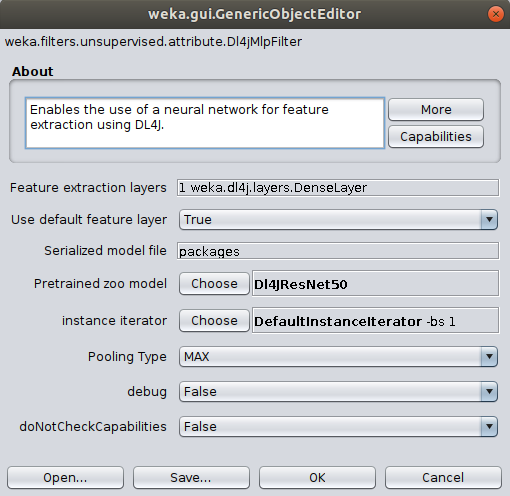
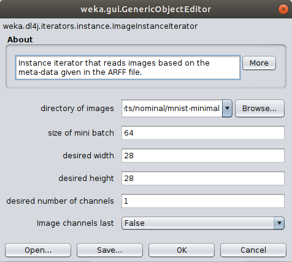
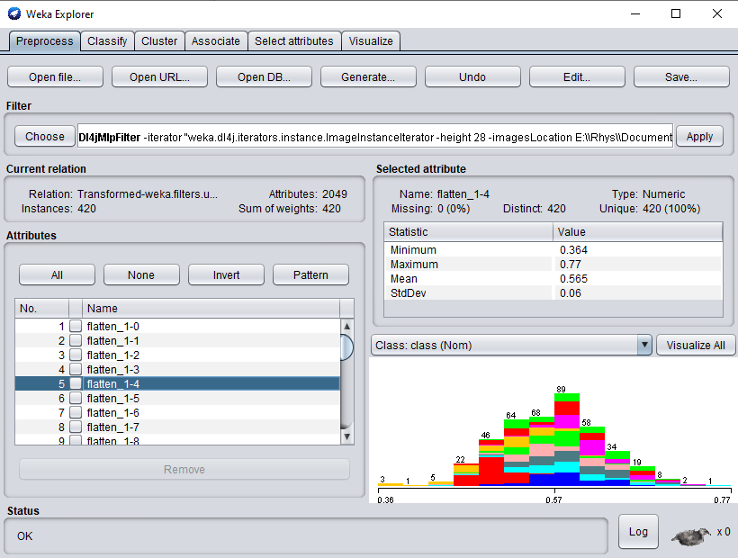
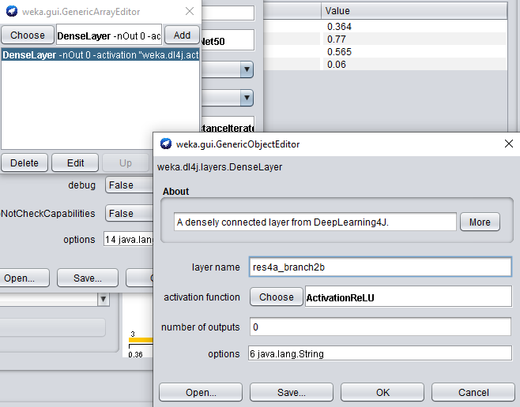
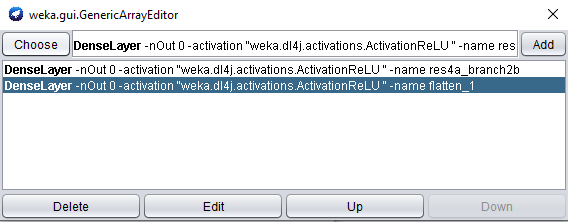
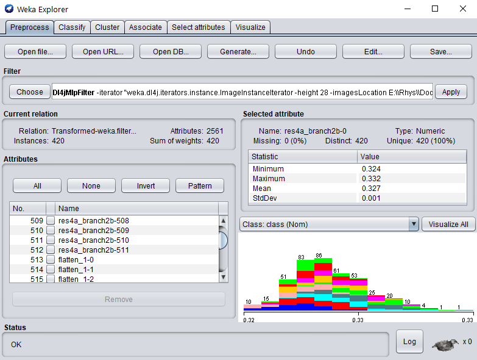

# Feature Extraction Tutorial

Instead of training a full neural network on your dataset, you may like to try using a pretrained model as a feature extractor and fitting a simpler model to those features. This technique (implemented with the `Dl4jMlpFilter`) uses the neuron activations from a layer within the model to convert your image dataset into a numeric form - any classical ML algorithm can then be fit to this new form.

## Extra Information

### Default Feature Extraction Layer

During feature extraction, the output activations from the designated **feature extraction layer** are used to create the '*featurized*' instances. 
All zoo models have a **default** feature extraction layer, which is typically the second-to-last layer in the model (e.g., [Dl4jResNet50](../user-guide/model-zoo/dl4j/DL4JResNet50.md)'s 
`default feature layer` is set to `flatten_1`). The second-to-last layer tends to give the most meaningful
activations, hence why it's set to the default.

### Concatenating Activations
As previously mentioned, by default the filter takes features from the final dense/pooling layer of the model (before the classification layer). 

You can also configure the filter to use any intermediary layer and concatenate the activations.

### Activation Pooling 
An important parameter when using intermediate layers is the filter's `PoolingType`. 
Activations from intermediate layers are often 3-dimensional for a given instance, so they need
to be reduced into a 1-dimensional vector. 
There are 4 pooling methods currently supported:
- `PoolingType.MAX` (default)
- `PoolingType.AVG`
- `PoolingType.SUM`
- `PoolingType.MIN`
 
These pool the 2nd and 3rd dimension into a single value, i.e., activations of 
`[512, 26, 26]` (512 26x26 feature maps) are pooled into shape `[512]`. You can also specify `PoolingType.NONE`
which simply flattens the extra dimensions (aforementioned example would become shape `[346112]`). 

`PoolingType` does not need to be specified when using the default activation layer - the outputs are already the correct dimensionality (`[batch size, num activations]`). If using an intermediary layer the outputs will typically be of size `[batch size, width, height, num channels]`.

## Starting Simple - Feature Extraction with the MNIST dataset
The following example walks through using a pretrained ResNet50 as a feature extractor on the MNIST dataset and fitting a model using a standard WEKA classifier to this transformed dataset.
This only takes 1-2 minutes on a modern CPU &mdash; much faster than training a large neural network from scratch.

The steps shown below split this into two steps; storing the featurized dataset, and fitting a WEKA classifier to the dataset. They can be combined into a single command with a `FilteredClassifier`, however, the method shown below is more efficient as the dataset featurizing (which is the most expensive part of this operation) is only done once (it would be done 10 times using 10-fold CV with a `FilteredClassifier`). Saving the featurized dataset separately also makes it much faster to try out different Weka classifiers.

### GUI

- Open the MNIST meta ARFF file in the Weka Explorer `Preprocess` tab via `Open File`. 
- Select the the `Dl4jMlpFilter` in the filter panel (within `filters/unsupervised/attribute`). Click in the properties box to open the filter settings.

  

- Set up the `ImageInstanceIterator` as we did in the [previous tutorial](2-training.md), setting the `directory of images` as the `mnist-minimal` directory containing the actual image files. The `width`, `height`, and `channels` are automatically set based on the zoo model's input shape 
([further explanation](../user-guide/model-zoo.md#image-instance-iterator)). 

- (Optional) Set the batch size according to your machine's capability; this won't change the end result but will make processing faster. If you run into memory issues then use a smaller mini-batch size.
  - If running on CPU then set to your machine's thread count. 
  - If running on GPU then set to a square number appropriate for your GPU's memory (e.g., 12GB GPU memory could set batch size to 32).

  

For now lets leave the `Zoo model` and `feature extraction layer` as their default values. `Dl4jResNet50` is already selected as the feature extractor model, and will by default use the final dense layer activations as the image features.

- Click `Apply` to begin processing your dataset. After completion, you should see your newly processed dataset!

  

- Switch to the `Classify` tab and select `SMO` as the classifier.
- Click `Start` to start training on your newly transformed dataset. 

You should get ~89% accuracy - certainly not SOTA but given the simplicity and speed of the method it's not bad! It should be noted that the training dataset size is very small (~400 instances) and also that the `ResNet50` weights are trained on ImageNet, which is a very different domain to MNIST
(classifying cars, animals, etc. vs classifying handwritten digits).

### Commandline

It should be noted that because we're using the default extraction layer for this model, we can simply specify the `-default-feature-layer` flag. This is especially useful if trying a range of different zoo models and one wants to avoid specifying layer names for each one.
 
```bash
$ java -Xmx8g weka.Run \
    .Dl4jMlpFilter \
        -i $WEKA_HOME/packages/wekaDeeplearning4j/datasets/nominal/mnist.meta.minimal.arff \
        -o mnist-rn50.arff \
        -c last \
        -decimal 20 \
        -iterator ".ImageInstanceIterator -imagesLocation $WEKA_HOME/packages/wekaDeeplearning4j/datasets/nominal/mnist-minimal -bs 4" \
        -zooModel ".Dl4jResNet50"
        -default-feature-layer
```
 We now have a standard `.arff` file that can be fit to like any numerical dataset
```bash
$ java weka.Run .SMO -t mnist-rn50.arff
```

## Activation Layer Concatenation and Pooling

We'll now walk through some more advanced customization options in the `Dl4jMlpFilter`; additional feature extraction layer concatenation, which allow you to use features from any layer in the model, and the `PoolingType` parameter, which specifies how extra dimensions should be pooled.

### GUI

- Select `Dl4jResNet50` as the feature extractor model. 
- Set `Use default feature layer` to `FALSE` - if this is not done, only the default
extraction layer will be used.
- Open the `Feature extraction layers` property, and open the properties for the `DenseLayer`.

  

When adding another feature extraction layer, only the `layer name` property needs to be set. 
- Set the `layer name` property to `res4a_branch2b`, and add the layer to our list.

  

The outputs from the default feature layer are already in 2 dimensions: `[batch_size, activations]`.

The outputs from `res4a_branch2b`, however, are 4-dimensional: `[batch_size, channels, width, height]`. This means that the `Pooling Type` property will be used to pool these extra dimensions (as explained at the beginning of this tutorial).

The default type is `MAX`, but for the sake of this tutorial we're going to use `AVG`

- Change the `Pooling Type` property to `AVG`. 

We're good to go! Apply the filter to begin processing the dataset; after completion, you should see your newly processed dataset! 



As before, we can fit any off-the-shelf WEKA classifier to this numerical dataset - no further processing required.

- Switch to the `Classify` tab and run `SMO` on our newly transformed datset - adding this extra layer should increase the accuracy very slightly! 

### Commandline
```bash
$ java -Xmx8g weka.Run \
    .Dl4jMlpFilter \
        -i $WEKA_HOME/packages/wekaDeeplearning4j/datasets/nominal/mnist.meta.minimal.arff \
        -o mnist-rn50-concat.arff \
        -c last \
        -decimal 20 \
        -iterator ".ImageInstanceIterator -imagesLocation $WEKA_HOME/packages/wekaDeeplearning4j/datasets/nominal/mnist-minimal -bs 4" \
        -poolingType AVG \
        -zooModel ".Dl4jResNet50" \ 
        -layer-extract ".DenseLayer -name res4a_branch2b" \
        -layer-extract ".DenseLayer -name flatten_1"         
```
We now have a standard `.arff` file that can be fit to like any numerical dataset
```bash
$ java weka.Run .SMO -t mnist-rn50-concat.arff
```

### Further Experiments

Now that we've shown you how to perform feature extraction, it's up to you to have a play with the different options available in **WekaDeeplearning4j**. 

- Load in your own dataset (or one of the extra datasets provided in the asset pack)
- Alter some options in the `Dl4jMlpFilter`
  - Try some of the different pretrained models
  - Add some extra activation layers. Check out the [model summary](https://deeplearning.cms.waikato.ac.nz/user-guide/model-zoo/#model-summaries) for your model to get the correct layer name. The attributes are named after the layer they were derived from, so more investigation can be done around which layer provides the most informative features (e.g., using the `Select Attributes` panel in WEKA).
  - Try different pooling modes and see what (if any) can improve over the default `MAX` pooling mode.
  
- After altering the `Dl4jMlpFilter` options, try some other WEKA classifiers (e.g., `RandomForest`) and try beat the accuracy achieved with `SMO`!
